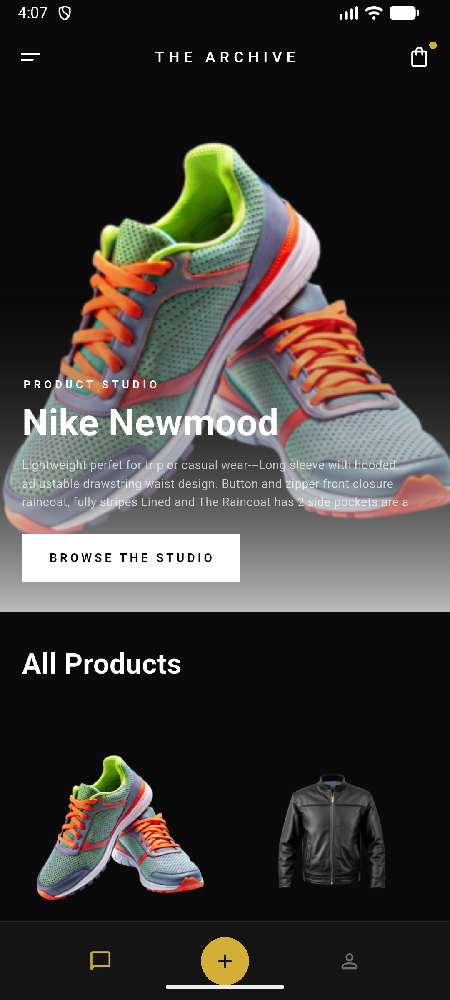
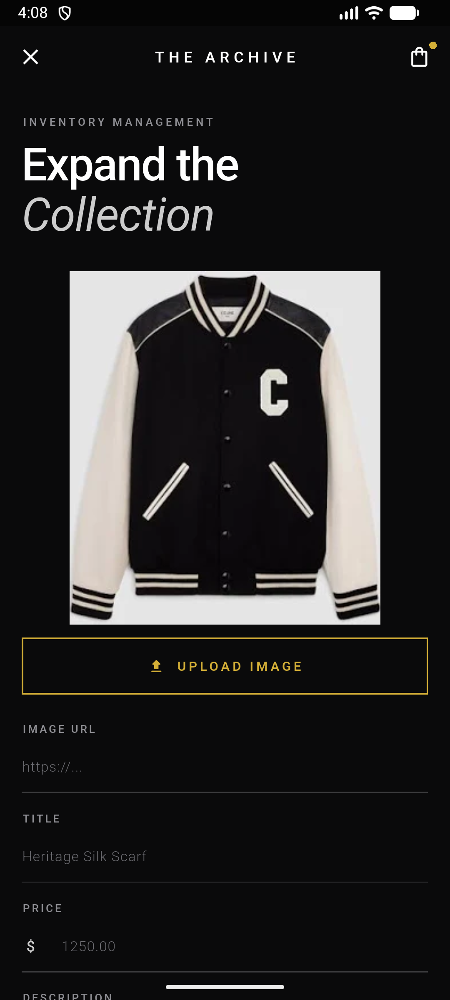
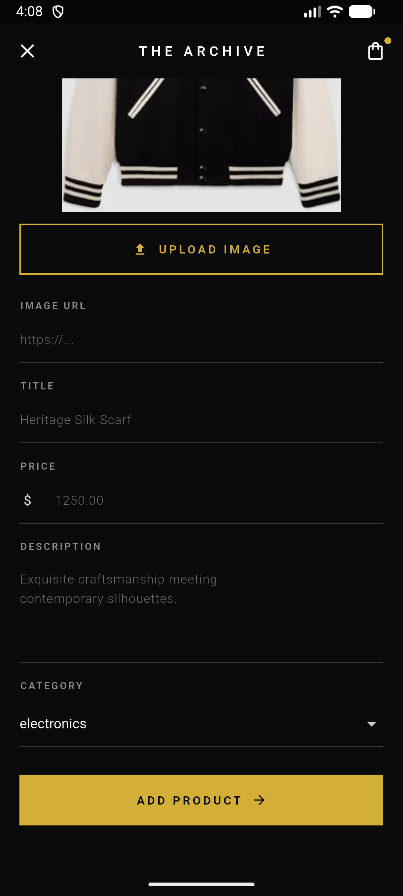
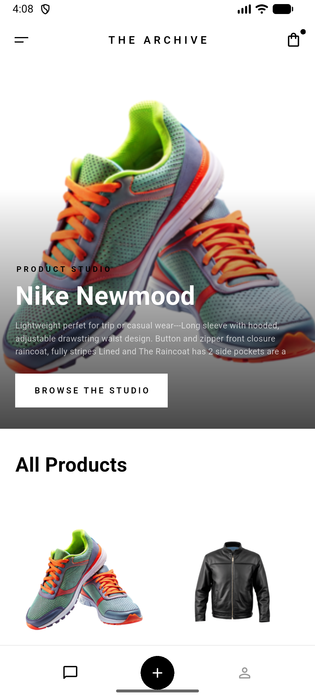
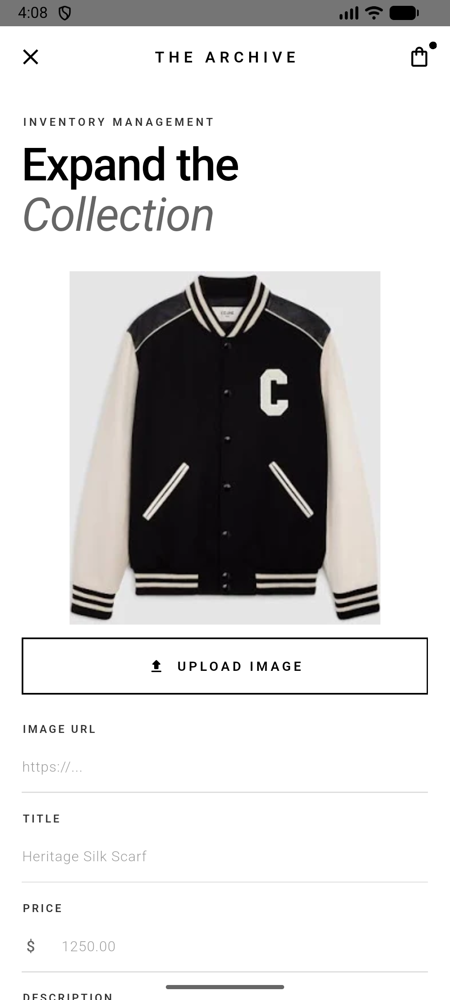
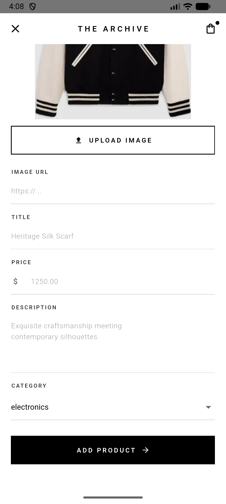

<p align="center">
  
</p>

# ShopX

A luxury minimalist e-commerce Flutter app that allows merchants to manage products (add, edit, update) through a clean and modern UI. Focused on RESTful API integration, backend communication, and real-world development practices, with API testing using Postman.
<br>
<br>
 


---
## 📱 Demo Video


Uploading ShopX 720.mp4…


### App Screenshots

| Home Page | Add Product 1 | Add Product 2 |
|:---:|:---:|:---:|
|  |  |  |
|  |  |  |

## ✨ Features
- **Luxury Minimalist UI**: Designed with a "Stark Contrast" color palette emphasizing clean lines, bold typography (Jost font), and negative space.
- **Dynamic Theme Management**: A fully custom theme toggle drawer that smoothly transitions the app between its light and dark states.
- **Product Management**: Robust interfaces for adding, editing, and managing products efficiently.
- **Local Image Uploads**: Integrated image picking functionality using `image_picker` for seamless product photo uploads.
- **Pull-to-Refresh**: Intuitive pull-to-refresh interactions ensuring the product feed is always up-to-date.
- **Category Selection**: Streamlined dropdown menus to categorize and organize inventory.
<br>
<br>

## 🧠 What I Learned

Building "The Archive" helped reinforce my understanding of core backend integration concepts and real-world development workflows:

1. **RESTful API Fundamentals**: Strengthened my understanding of RESTful APIs, including how to send requests, handle responses, and update data dynamically within the app.

2. **API Testing with Postman**: Gained hands-on experience working with APIs using **Postman**, which helped me understand request/response cycles and debug backend communication effectively.

3. **Frontend & Backend Integration**: Learned how to connect the Flutter frontend with backend services, ensuring smooth data flow and proper handling of asynchronous operations.

4. **Collaboration with Backend Developers**: Understood the importance of coordinating with backend developers, aligning on API structure, endpoints, and data models to build a fully functional application.
---
<br>
<br>

## 📂 Project Structure (`lib/`)
```text
lib/
├── core/                           # Theming, constants, styles, and utilities
│   ├── app_colors.dart
│   ├── app_styles.dart
│   ├── consts.dart
│   ├── extenuations.dart
│   └── theme_provider.dart
├── models/                         # Data models
│   └── product_model.dart
├── screens/                        # UI screens
│   ├── home/
│   │   ├── home_screen.dart
│   │   └── widgets/
│   │       ├── art_of_everyday_section.dart
│   │       ├── hero_banner.dart
│   │       ├── product_card.dart
│   │       └── section_header.dart
│   └── update_product/
│       ├── update_product_screen.dart
│       └── widgets/
│           ├── archive_dropdown_field.dart
│           ├── archive_form_field.dart
│           └── product_image_preview.dart
├── services/                       # API/Network services
│   ├── add_product.dart
│   ├── api_class.dart
│   ├── get_all_products.dart
│   ├── get_categories.dart
│   ├── get_category_products.dart
│   └── update_product.dart
├── widgets/                        # Reusable UI components
│   ├── archive_app_bar.dart
│   ├── archive_bottom_nav_bar.dart
│   ├── archive_drawer.dart
│   ├── custom_button.dart
│   ├── custom_product_card.dart
│   ├── custom_text_field.dart
│   └── show_snack_bar.dart
└── main.dart                       # Application entry point
```

## 🛠️ Tech Stack
- **Framework**: [Flutter](https://flutter.dev/)
- **Language**: Dart
- **Key Packages**:
    - `image_picker` for image handling.
    - `http` for network requests.
    - `cupertino_icons` and custom fonts natively integrated.

## 🚀 Getting Started

To get a local copy up and running, follow these simple steps:

### Prerequisites
Make sure you have Flutter installed on your machine. You can find the installation guide [here](https://docs.flutter.dev/get-started/install).

### Installation
1. Clone the repo
   ```sh
   git clone https://github.com/your_username/new_shopx.git
   ```
2. Navigate to the project directory
   ```sh
   cd new_shopx
   ```
3. Install Flutter dependencies
   ```sh
   flutter pub get
   ```
4. Run the app
   ```sh
   flutter run
   ```

Feel free to fork the project and open a PR if you have any improvements!
